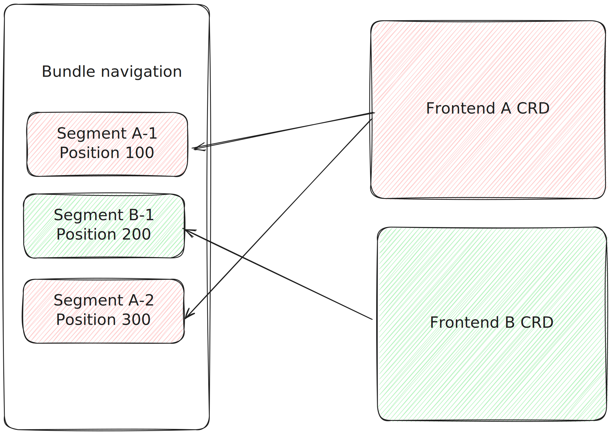

# Navigation

The main navigation in HCC UI is configured via the frontend operator. The operator has two navigation definition options:
- Bundle segments
- Navigation segments

## Bundle segments

A bundle segment is a navigation configuration segment that is directly added into a bundle navigation. A bundle navigation is a global navigation for a particular bundle. A bundle is a section of HCC, divided by a top-level pathname.

For example, the Insights bundle includes all applications under the `/insights` pathname segment. The Settings bundle apps are under the `/settings` pathname segment, and so on.

A bundle segment can be injected into a single bundle navigation.

## Bundle segment spec

An example of a bundle segment:

```yaml
objects:
  - spec:
      bundleSegments:
        - segmentId: bundle-segment-id
          bundleId: target-bundle-id
          position: 400
          navItems: []

```

### **`segmentId`**
*string*

Unique identifier of bundle segment

### **`bundleId`**
*string*

An ID if the targeted bundle. The list available bundles is defined by the environment in which HCC is running. For example, the stage environment might have different list of bundles than production.

### **`position`**
*number*

A priority of the segment, defining the position of the segment navigation items. It is recommended to leave enough "space" between individual segments in a bundle. Steps of 100 are recommended. This will ensure future segments can be comfortably injected into the bundle if needed.

If navigation items from different UI modules are supposed to be in between navigation items within a segment **the segment should be split in two**.



### **`navItems`**
*array*

Actual nav item definitions of the segment. There are two types of valid nav items:
- [Direct navigation item](#direct-navigation-item)
- [Navigation segment](#navigationsegment)

Follow the links to learn more about them and their purpose.

## Direct navigation item

Direct navigation items directly define navigation items and their attributes. These will be used in majority of the cases.

Direct navigation items can be used both in [Bundle segments](#bundle-segments) and [Navigation segments](#navigation-segment).

### Simple navigation item attributes

A simple link. Can be internal or external.

```ts
type DirectNavItem = {
  title: string;
  href: string;
  id: string;
  isHidden?: boolean;
  isExternal?: boolean;
  product?: string;
  notifier?: string;
  isBeta?: boolean;
  permissions?: Permission[]
}
```

#### **`title`**
*string*

Human readable title.

#### **`href`**
*string*

Equivalent to the `href` attribute for the `a` HTML element.

#### **`id`**
*string*

Unique identifier of the nav item.

#### **`isHidden`**
*bool*
*(optional)*

Adds the HTML element to the DOM, but does not display it.

> If you are looking to conditionally show/hide navigation items use the [permissions attribute](#permissions) instead.

#### **`isExternal`**
*bool*
*(optional)*

The link leads to a different domain. Clicking the link will open a new browser tab.

#### **`product`**
*string*
*(optional)*

A human readable description of the product to which the link leads. Can be used to provide additional context to the Chrome UI.

#### **`notifier`**
*string*
*(optional)*

Display a notification icon if a specific event was registered in Chrome UI.

#### **`isBeta`**
*bool*
*(optional)*

Link leads to a feature that is in preview mode. User will be switched to preview version of the HCC UI if in stable mode.

#### **`permissions`**
*array*
*(optional)*

Rules to conditionally show/hide the navigation item. The permissions function are listed in [Chrome UI docs](https://github.com/RedHatInsights/insights-chrome/blob/master/docs/navigation.md#permissions)

### Expandable navigation item

A navigation item that can be expanded and show more navigation items as its children. Clicking the expandable navigation item does not redirect user to any URL.

> It is not recommended to have a deeply nested navigation structure. Multiple levels lead to degraded user experience and visual experience.

```ts
type ExpandableNavigationItem = {
  expandable: bool;
  title: string;
  id: string;
  routes: (DirectNavItem | ExpandableNavigationItem | NavigationSegment)[]
  permissions?: Permission[]
}
```
#### **`expandable`**
*bool*

A flag to mark navigation item as expandable.

#### **`title`**
*string*

Human readable title.

#### **`id`**
*string*

Unique identifier of the nav item.

#### **`routes`**
*array*

Child navigation items of the expandable navigation item.

#### **`permissions`**
*array*
*(optional)*

Rules to conditionally show/hide the navigation item. The permissions function are listed in [Chrome UI docs](https://github.com/RedHatInsights/insights-chrome/blob/master/docs/navigation.md#permissions)

### Navigation group

Groups navigation items into a section. The section has a label above all the links and can have an icon. **Child items are always visible, unlike for expandable items**.

```ts
type NavigationItemGroup = {
  groupId: string;
  title: string;
  navItems: (DirectNavItem | ExpandableNavigationItem | NavigationSegment)[]
  icon?: string;
  permissions?: Permission[]
}
```
#### **`groupId`**
*string*

A unique identifier of the group

#### **`title`**
*string*

Human readable group label.

#### **`navItems`**
*array*

Child navigation items of the navigation group.


#### **`icon`**
*string*
*(optional)*

A PF icon to display along the group label.

#### **`permissions`**
*array*
*(optional)*

Rules to conditionally show/hide the navigation item. The permissions function are listed in [Chrome UI docs](https://github.com/RedHatInsights/insights-chrome/blob/master/docs/navigation.md#permissions)

## Navigation segment

Navigation segment is a group of navigation items, that has to be explicitly placed into a [Bundle segment](#bundle-segments) or as a child of [Expandable item](#expandable-navigation-item) or [Navigation group](#navigation-group). Segments should be used only if:
- An exact copy of navigation items in segment should be used.
- A navigation from foreign UI module needs to be injected into UI module bundle segment in a nested structure (expandable or group).

An example of navigation segment:

```yaml
objects:
  - metadata:
      name: ui-module-A
    spec:
      navigationSegments:
        - segmentId: ui-module-A-segment-one
          navItems:
            - title: Foreign link A
              id: foreign-link-a
              href: /foreign-link-a
            - title: Foreign link B
              id: foreign-link-b
              href: /foreign-link-b

```

An example of placing a navigation segment into bundle segment:

```yaml
objects:
  - metadata:
      name: ui-module-B
    spec:
      bundleSegments:
        - segmentId: module-B-segment
          bundleId: foo
          position: 444
          navItems:
            - segmentRef:
                segmentId: ui-module-A-segment-one
                frontendName: ui-module-A
            - title: Local link
              id: local-link
              href: /foo/bar

```
To prevent duplicate IDs and any ambiguity when referencing navigation segments, not only correct segment ID has to be used, but also the Frontend origin of the segment.


The FEO will join the two resources. The final structure of the `module-B-segment` navigation segment will look like this after the reconciliation:

```yaml
objects:
  - metadata:
      name: ui-module-B
    spec:
      bundleSegments:
        - segmentId: module-B-segment
          bundleId: foo
          position: 444
          navItems:
            - title: Foreign link A
              id: foreign-link-a
              href: /foreign-link-a
            - title: Foreign link B
              id: foreign-link-b
              href: /foreign-link-b
            - title: Local link
              id: local-link
              href: /foo/bar
```

Any type of [Direct navigation item](#direct-navigation-item) can be used while defining navigation segment items. 

### **`segmentId`**
*string*

A unique ID of a segment withing a single Frontend resources.

### **`navItems`**
*array*

> It is recommended to use direct navigation items if possible.

Actual nav item definitions of the segment. There are two types of valid nav items:
- [Direct navigation item](#direct-navigation-item)
- [Navigation segment](#navigationsegment)
