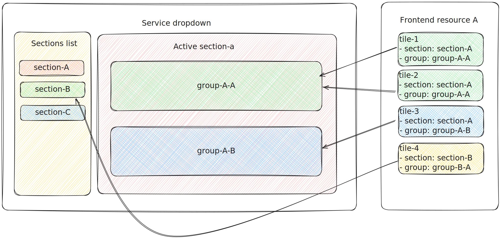

# All services dropdown items

To add a tile to the all services dropdown, a service tile must be defined.

Service tiles can be injected into a section and within a section into a group.

Sections, groups, and individual tiles are always sorted alphabetically in the all services dropdown.

## Service tiles spec

The service tiles are defined in the following place:

```yaml
objects:
  - spec:
      serviceTiles:
        - id: "landing-tile"
          section: automation
          group: ansible
          title: "Landing tile"
          description: "Landing page description"
          href: /
          icon: SomeIcon
```

### **`id`**
*string*

A unique ID of service tile within group


### **`section`**
*string*

ID of a services dropdown section. The list available sections is defined by the environment in which HCC is running. For example, the stage environment might have different list of sections than production.

### **`group`**
*string*

ID of a services dropdown section group. The list available section groups is defined by the environment in which HCC is running. For example, the stage environment might have different list of section groups than production.


### **`title`**
*string*

A title of the service tile entry


### **`description`**
*string*

Detailed description of the service tile. Should describe the location towards the service tile leads.


### **`href`**
*string*

Equivalent to the `href` attribute for the `a` HTML element.

#### **`icon`**
*string*
*(optional)*

Icon of the service tile

#### **`isExternal`**
*bool*
*(optional)*

The link leads to a different domain. Clicking the link will open a new browser tab.

#### **`permissions`**
*array*
*(optional)*

Rules to conditionally show/hide the service tile item. The permissions function are listed in [Chrome UI docs](https://github.com/RedHatInsights/insights-chrome/blob/master/docs/navigation.md#permissions)


## Example distribution


